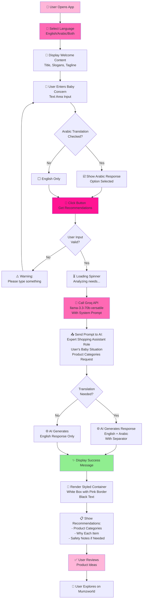

# Mumzworld Assistant - Application Flowchart

## How the Application Functions

## Process Flow Overview

### Stage 1: Initialization & Language Selection
- User opens the Streamlit application
- Language selector appears at the top (English/Arabic/Both)
- Based on selection, appropriate content is displayed

### Stage 2: Content Display
- Welcome message with emoji animations
- Tagline and description
- Input box appears for user to enter their concern

### Stage 3: User Input & Configuration
- User types their baby-related concern
- Optional checkbox to include Arabic translation in response
- Submit button activated

### Stage 4: Input Validation
- App checks if text area has content
- If empty, warning message shown
- If valid, proceeds to API call

### Stage 5: AI Processing via Groq API
- System sends user's concern to Groq API
- Model: `llama-3.3-70b-versatile`
- AI acts as expert shopping assistant for Mumzworld
- AI generates 3-5 product category recommendations

### Stage 6: Response Generation
- If translation requested: AI provides English + Arabic versions
- If English only: Single language response
- Includes product explanations and safety notes when needed

### Stage 7: Display & User Action
- Success message shown
- Response rendered in styled white container with pink border
- User reviews recommendations
- User can explore products on Mumzworld

## Key Components

| Component | Purpose |
|-----------|---------|
| **Language Selector** | Enables bilingual support (EN/AR) |
| **Text Area** | Captures user's baby concern |
| **Checkbox** | Enables/disables Arabic translation |
| **Submit Button** | Triggers API call |
| **Groq API Integration** | Provides AI-powered recommendations |
| **Styling Container** | Pink theme with responsive design |
| **Loading Spinner** | Indicates processing status |

## Error Handling

- **Empty Input**: Warning message prompting user to enter text
- **API Errors**: User-friendly error messages displayed
- **Network Issues**: Caught and displayed gracefully

---

Generated: April 29, 2026
